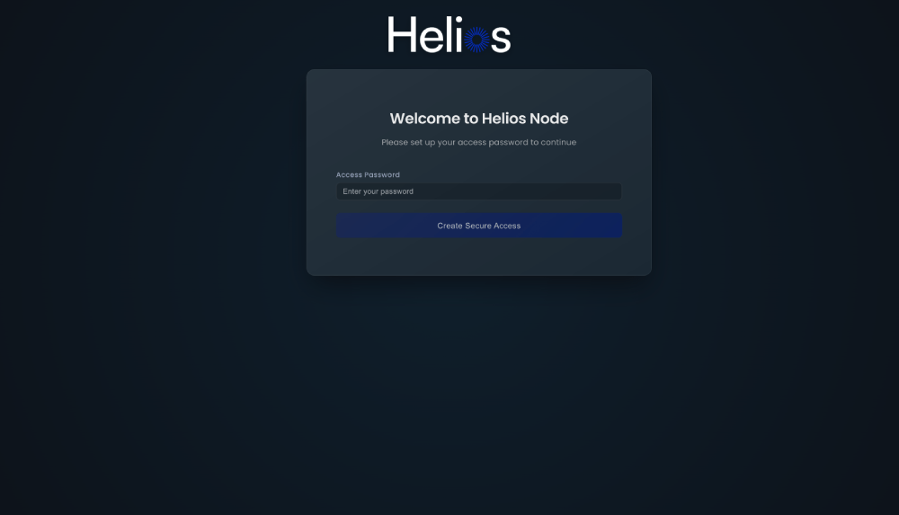

<h1 align="center">Helios - CLI</h1>

<p align="center">
  
  <br>
  <i>Helios CLI is a command line for building windows, linux and macos Nodes
  <br>
</p>

<p align="center">
<a href="https://npmjs.org/package/@heliosfoundation/helios-cli">

</a>&nbsp;
<a href="https://tldrlegal.com/license/mit-license">
</a>
</p>

## Installation

````shell
npm install -g @heliosfoundation/helios-cli
````

## Usage

````shell
helios [command] [options]
helios --help
````

````shell
helios install
````

#### `[command]`

- `helios install` - install NodeManager
- `helios start` - start NodeManager
- `helios stop` - stop NodeManager
- `helios reset` - reset NodeManager

#### `--help|-h`

Show help

### Examples

#### `helios install`

Use for create sample application :

````shell
$ helios install
✔ Successfully installed NodeManager.
````

#### `helios start`

Use for start NodeManager :

````shell
$ helios start
✔ NodeManager started successfully you can access it at http://0.0.0.0:8080
````

Go to http://localhost:8080



#### `helios stop`

Use for stop NodeManager :

````shell
$ helios stop
✔ NodeManager stopped successfully
````

#### `helios reset`

Use for reset NodeManager :

````shell
$ helios reset
✔ NodeManager reset successfully
````

## License

